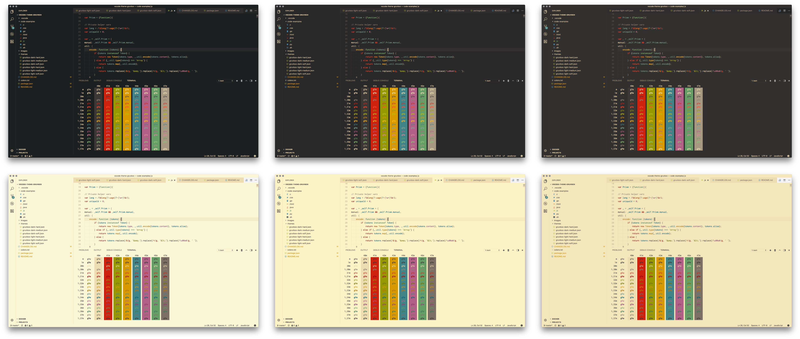

<h1 align="center">
  <br>
  <a href="https://marketplace.visualstudio.com/items?itemName=jdinhlife.Fern">
    
  </a>
  <br>
  Fern
  <br>
</h1>

<h4 align="center">A port of Fern theme to VS Code editor</h4>

<p align="center">
  <a href="https://marketplace.visualstudio.com/items?itemName=jdinhlife.Fern">
    
  </a>
  <a href="https://marketplace.visualstudio.com/items?itemName=jdinhlife.Fern">
    
  </a>
  <a href="https://marketplace.visualstudio.com/items?itemName=jdinhlife.Fern">
    
  </a>
  <a href="https://marketplace.visualstudio.com/items?itemName=jdinhlife.Fern">
    
  </a>
</p>

## About

A [Fern](https://github.com/morhetz/Fern) theme including syntax highlighting and workbench & terminal colors.

## Installation

Launch _Quick Open_

-  <a href="https://code.visualstudio.com/shortcuts/keyboard-shortcuts-linux.pdf">Linux</a> `Ctrl+P`
-  <a href="https://code.visualstudio.com/shortcuts/keyboard-shortcuts-macos.pdf">macOS</a> `⌘P`
-  <a href="https://code.visualstudio.com/shortcuts/keyboard-shortcuts-windows.pdf">Windows</a> `Ctrl+P`

Paste the following command and press `Enter`:

```
ext install jdinhlife.Fern
```

## Variants

- Dark - Medium Contrast
- Dark - Hard Contrast
- Dark - Soft Contrast
- Light - Medium Contrast
- Light - Hard Contrast
- Light - Soft Contrast

### Screenshots



## Contributing

Please, report issues/bugs and suggestions for improvements to the issue [here](https://github.com/jdinhify/vscode-theme-Fern/issues).

Please contribute if you have any suggestions. **PRs are welcomed!** :rocket:

### Tips

- In the `json` file, `scope` can be an `array` or a `string` of CSS classes
- VSCode's `Developer: Inspect TM Scopes` command is useful to find out the scope
- `colors.txt` contains available colors

## Release Notes

See [changelog](CHANGELOG.md).

## Credits

Special thank to [Pavel Pertsev](https://github.com/morhetz), the creator of [Fern](https://github.com/morhetz/Fern) original theme.

### Contributors

- [eximus](https://github.com/3ximus)
- [Josh Addington](https://github.com/JoshAddington)
- [michaelboulton](https://github.com/michaelboulton)
- [Michell Stuttgart](https://github.com/mstuttgart)
- [sedmicha](https://github.com/sedmicha)
- [Layo](https://github.com/layoaster)
- [Maxim Tsoy](https://github.com/muodov)
- [Huip van den Ende](https://github.com/huipvandenende)
- [Christian Klaussner](https://github.com/klaussner)
- [Anton Shpigunov](https://github.com/shpigunov)
- [Piotr Więckiewicz](https://github.com/piotrwieckiewicz)
- [Andrew Malchuk](https://github.com/amalchuk)

Thanks for help to make the Fern theme better.

Copyright (C) 2017 [JD](https://github.com/jdinhify)
